[English](README.md) | [中文](README_CN.md)

---
<h1 align="center">gotribe-admin</h1>

<div align="center">
Go + Vue开发的小型 cms 解决方案, 主题丰富，开箱即用，企业级架构。适合个人、团队、中小企业等使用。
<p align="center">


</p>
</div>

## 🚀 核心优势：

性能卓越：基于 Golang 的高效并发处理能力，GoTribe 能够轻松应对高流量网站的需求。
易于使用：简洁直观的用户界面和文档，让即使是初学者也能快速上手。
高度可定制：提供丰富的API和插件支持，满足个性化的建站需求。
社区支持：活跃的开源社区，持续提供更新和技术支持。
安全稳定：遵循最佳安全实践，保障网站数据的安全和稳定运行。

## 💥 适用场景：
无论是个人博客、团队，还是企业网站，GoTribe 都能提供强大的支持和灵活的定制选项。

## 🎨 效果展示


## 🌌 项目说明

项目整体采用前后端分离。由管理端 API，业务端 API，管理后台UI 三部分组成，业务端 UI 可自行根据需求开发。也可使用我们的模版
### 项目
| 项目                | 描述       |地址|
|-------------------|----------| --- |
| **gotribe-admin** | 后台管理 api | https://github.com/go-tribe/gotribe-admin.git |
| gotribe           | 业务端 api  | https://github.com/go-tribe/gotribe.git |
| gotribe-admin-vue | 管理后台 UI  | https://github.com/go-tribe/gotribe-admin-vue.git |

### 业务主题
| 主题           | 描述        | 地址                                           |
|--------------|-----------|----------------------------------------------|
| gotribe-blog | 一个简单的博客主题 | https://github.com/go-tribe/gotribe-blog.git  |

### 关系图

```mermaid
    graph LR
    A[Go-Tribe 项目] --> B(gotribe-admin管理后台)
    A --> C(gotribe业务端API)
    A --> E(gotribe-blog 博客主题)

    B --> F[数据库]
    C --> F

    E --> G[业务端 UI]
    G -->|用户自定义| H[业务主题]
    H --> I[gotribe-blog 博客主题]
```

上图清晰地描绘了Go-Tribe项目的结构和组件之间的交互：

**Go-Tribe** 是整个系统框架的名称，它包括多个模块，每个模块负责不同的功能。  

**gotribe-admin 管理后台**：这是系统的核心管理模块，用于处理后台管理任务。考虑到安全性，通常部署在内部网络并通过VPN访问。为了简化部署流程，我们将gotribe-admin-vue 管理后台 UI与管理后台 API集成在一起，实现一键部署。  

**gotribe 业务端 API**：此模块负责处理业务逻辑，特别关注搜索引擎优化（SEO）和开发效率。它与业务端 UI 完全解耦，支持 Kubernetes 部署和水平扩展，以适应不同规模的业务需求。  

**gotribe-blog 博客主题**：提供了一个预构建的博客主题，作为业务主题的一个示例，展示如何利用Go-Tribe框架快速搭建特定业务场景。  

**数据库**：作为系统的数据存储中心，负责保存所有必要的数据信息。  

**业务端 UI**：用户可以根据自己的具体需求，利用Go-Tribe提供的模板自行开发定制化的前端界面。  

整个系统采用前后端分离的架构设计，这不仅提高了系统的灵活性，还使得各个组件能够独立开发和维护，从而增强了系统的可扩展性和维护性。  

### 快速开始

> 环境要求：`go1.20 +` `node 18 +`。

1. 下载项目

```
git clone --recursive https://github.com/go-tribe/gotribe-admin.git
```
2. 修改配置文件,参数说明详见：`config.tmp.yml`。

```
cp config.tmp.yml config.yml
```
3. 开发运行：

```
make run
```
4. 编译打包:

```
make
```
编译完成后,可执行文件在`_output`目录下。

启动后会自动迁移数据库，管理后台默认用户名：admin 密码：123456

## 🍁 TODO

- 增加支付配置
- 增加商品管理

## 💥 在线应用
[麻凡](https://www.dengmengmian.com)
## 🌎 License

[MIT](https://choosealicense.com/licenses/mit/)
